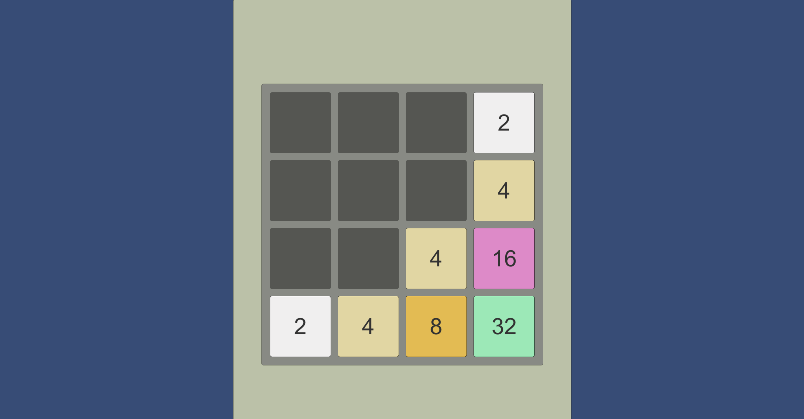
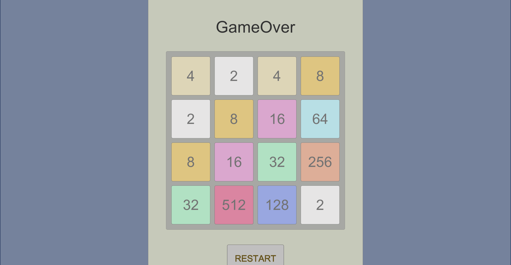

# 2048 Game Implemented by Unity

## 1. Main UI

By Author:

> Just a simple demo to get me some hands-on experience with Unity. 



**General Rule:**

Combine spawns that have same value to get a '2048'

**Basic Commands are:**
```
space: Ramdomly Fill an Empty Spawn with '2' or '4'
w/a/s/d: Slide up/left/down/right  
```

## 2. GameOver

**Condition:**

There is no potential move. 

*You may have another try by clicking RESTART*


